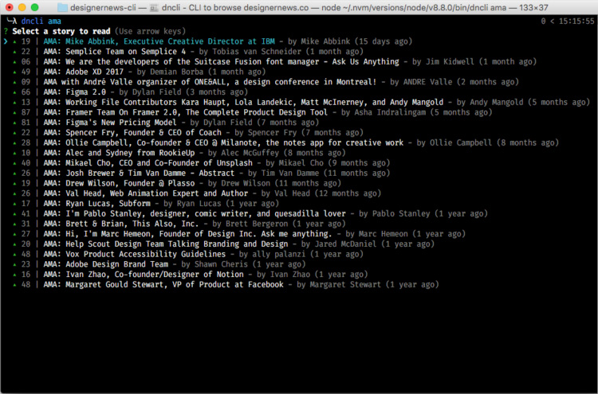

# dncli
> 📰 CLI to browse designernews.co

<br>
<p align="center"></p>
<br>


## Install

```
$ npm install -g dncli
```


## Usage

```
$ dncli
```

### List stories by badges

```
$ dncli apple
```

Avaliable badges: `apple`, `ask`, `ama`, `css`, `discussion`, `podcast`, `show`, `design`, `type`, `video`.
